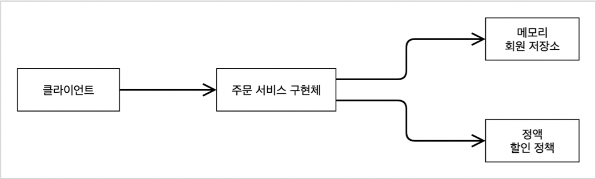

# 2. 스프링 핵심 원리 이해 1 - 예제 만들기

## 2.1 프로젝트 생성

### build.gradle
- plugins
    - 사용하는 플러그인 id와 버전
- group
    - 프로젝트 개발 그룹명
- version
    - 프로젝트 버전
- sourceCompatibility
    - 사용 jdk 버전
- repositories
    - 라이브러리들을 받아올 외부 저장소 위치
- dependencies
    - 사용하는 dependency(라이브러리) 정보
    - Spring Boot 프로젝트 생성 시 별도의 dependency를 추가하지 않으면 spring-boot-starter(core, context)와 spring-boot-starter-test만 로드
- test
    - 사용하는 test 라이브러리 정보

build.gradle 수정 후 새로고침 해주어야 적용되어 라이브러리에 반영됨

### IntelliJ - Gradle 대신 Java 직접 실행
Gradle 통해서 실행(IntelliJ 기본 설정) -> Java 직접 실행으로 변경 
Gradle 통해서 실행 시 실행 속도 느림, Java 직접 실행이 더 빠름

## 2.3 회원 도메인 설계

### 다이어그램

#### 회원 도메인 협력 관계
<!--  -->

#### 회원 클래스 다이어그램
<!--  -->

#### 회원 객체 다이어그램
<!--  -->

도메인 협력 관계 -> 클래스 다이어그램 -> 객체 다이어그램
- 도메인 협력 관계 : 기획자들도 볼 수 있는 다이어그램
- 클래스 다이어그램 : 클래스, 인터페이스 등의 관계도
- 객체 다이어그램 : 애플리케이션이 실행된 뒤 객체들 간의 관계도

## 2.4 회원 도메인 개발

### Interface and Implementor Naming
- Interface에 대해 Implementor가 하나밖에 없을 때, 관례상 Implementor 이름 마지막에 Impl을 붙인다. 
ex) MemberServiceImpl
- 그러나 Impl을 붙이는 방법은 Implementor를 특징을 명확하게 보여주는 이름이 아니고, 혼란스러울 수 있기 때문에 좋은 방법은 아니다.
- 보통 Interface를 사용하는 경우 해당 Interface를 구현하는 Implementor가 여러 개 존재하는 경우가 많은데, Implementor의 특징을 나타낼 수 있도록 이름을 붙이는 것이 좋다. 
ex) MemoryMemberRepository, DBMemberRepository
- Interface에 대한 Implementor가 하나인 경우, 즉 해당 기능이 추가 확장될 가능성이 없는 경우라면 Implementor가 굳이 필요한 경우가 아니니 Interface를 없애고 구체 class로 바로 만들었다가 추후 필요할 때 리팩토링해서 Interface를 도입한다.
- 참고 [링크](https://thomaspoignant.medium.com/java-how-to-name-interface-and-implementor-94c0fa564b87)

### HashMap
- 여러 곳에서 사용하는 경우, 동시성 이슈가 발생할 수 있어 동시성 이슈가 없는 ConcurrentHashMap을 사용하는 것이 좋다.
- 이 예제에서는 DB 확정 전에 개발 및 테스트용으로만 사용되고 예제의 복잡도를 줄이기 위해 그냥 HashMap을 사용하였다.
- static으로 선언하여 모든 MemoryMemberRepository 객체에 대해 1개만 존재, 항상 동일한 HashMap 객체에 데이터가 저장될 수 있도록 선언한다.

### Entity Variable
Entity로 사용되는 클래스의 변수는 Null 값을 가질 수 있는 Wrapper class 또는 Reference Type을 사용하는 것이 권장된다.

## 2.5 회원 도메인 실행과 테스트

- 애플리케이션 로직에서 직접 테스트하는 것은 좋은 방법이 아니다. 
매번 콘솔 등에서 결과가 올바른지 직접 확인해야 하고, 반복적으로 여러 테스트를 실행하기 어려움 등 여러 한계가 있다. 
-> 따라서 JUnit과 같은 테스트 프레임워크를 활용하여 테스트하는 것이 좋다
- 테스트 코드는 실제 Production 코드가 있는 main 폴더와는 별도로 src 폴더 내 test 폴더라는 곳에 작성한다. 
빌드 시 실제 production에는 main 폴더의 코드만 포함되고 test 폴더의 코드는 자동으로 제외된다. 따라서 빌드 후 운영 환경에 배포 시 main의 코드만 나가게 된다.
- 현대의 서비스 개발에서 테스트 코드 작성은 선택이 아닌 필수!!
- Test 코드 작성 시 given - when - then 으로 구분해서 생각하면 편리하다.

## 2.6 주문과 할인 도메인 설계

### 다이어그램

#### 주문 도메인 협력 관계
<!--  -->

#### 주문 클래스 다이어그램
<!--  -->

#### 주문 객체 다이어그램1
<!--  -->

#### 주문 객체 다이어그램2
<!--  -->

역할과 구현을 분리하여 설계 -> 자유롭게 구현 객체를 조립할 수 있다. 
저장소나 할인 정책이 객체 다이어그램 1에서 2처럼 바뀌어도 주문 서비스를 변경할 필요 없이 기존의 역할 관계를 그대로 사용할 수 있다.

## 2.7 주문과 할인 도메인 개발

- OrderServiceImpl 구현 시 MemberRepository를 직접 이용하여 member 정보를 가져왔으나 이미 이전에 구현한 MemberService의 findMember()를 이용해서 가져올 수도 있다.

### Static Factory Method (정적 팩토리 메소드) - [참고 링크](https://johngrib.github.io/wiki/static-factory-method-pattern/)
- Order의 생성자를 이용해 Order 객체를 생성하는 것이 아닌 createOrder()라는 함수를 따로 만들어 Order 객체 생성에 이용하는 방식
- createOrder()가 정적 팩토리 메소드는 아님. 비슷하지만 여기서는 단순히 Order 객체를 생성하는 역할을 담당하는 메소드
- Static Factory Method는 보통 본인 스스로 생성하는 메소드로 이 프로젝트에서 사용한다면 Order에 위치
    - 생성자에 비해 가독성이 좋다
    - 호출할 때마다 새로운 객체를 생성할 필요가 없다
    - 하위 자료형 객체를 반환할 수 있다
- Member와 같이 간단한 객체는 생성자를 그냥 사용하는 것이 더 낫다.

## 2.8 주문과 할인 도메인 실행과 테스트

- 순수 Java만 이용하는 테스트는 별로 오래 걸리지 않는(수천 개가 있어도 몇 초 내로 완료됨) 반면 Spring을 띄워야 하는 테스트는 오래 걸린다.
- 따라서 순수 Java만 이용하는 테스트, 즉 단위 테스트를 잘 작성해야 한다.
- Spring까지 띄워서 돌려야 하는 전체 테스트 대비 빨리 종료되기 때문에 더 자주 돌려볼 수 있기 때문 -> 가능한 단위 테스트에서 에러를 다 잡아내는 것이 좋다.