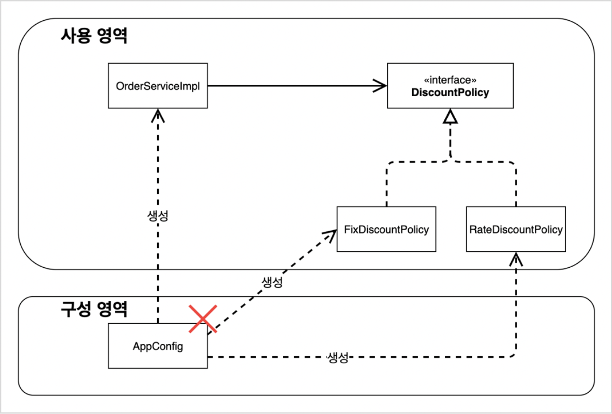

# 3. 스프링 핵심 원리 이해 2 - 객체 지향 원리 적용

## 3.1 새로운 할인 정책 개발

- 애자일 소프트웨어 개발 선언 - [링크](https://agilemanifesto.org/iso/ko/manifesto.html)

- 테스트 코드를 작성할 때, 성공하는 케이스도 중요하지만 실패하는 케이스 또한 중요하다.

## 3.2 새로운 할인 정책 적용과 문제점

- DIP(Dependency Inversion Principle)
    - 추상화에 의존해야지 구체화에 의존하면 안된다.
    - 구현 클래스가 아닌 인터페이스에 의존해야 한다.
- OCP(Open-Closed Principle)
    - 확장에는 열려 있고, 변경에는 닫혀 있어야 한다.
    - 기존 코드의 변경 없이 확장이 가능해야 한다.

### 문제점

- 역할과 구현을 충실히 분리했다 -> O
- 다형성을 활용해 인터페이스와 구현 객체를 분리했다 -> O
- OCP, DIP와 같은 객체 지향 설계 원칙을 준수했다 -> ?
    - DIP 위반<br>
    OrderServiceImple은 인터페이스인 DiscountPolicy와 구현체인 FixDiscountPolicy 둘 다에게 의존하고 있다.
    - OCP 위반<br>
    RateDiscountPolicy로 변경하려면 기존의 OrderServiceImple의 코드도 변경해야 한다.
    ```Java
    DiscountPolicy discountPolicy = new FixDiscountPolicy();
     ```

<br>

- 따라서 DIP, OCP를 지키기 위해서는 인터페이스에만 의존하도록 코드를 변경해야 한다.
```Java
DiscountPolicy discountPolicy; // = new FixDiscountPolicy();
```
- 단 이렇게만 하면 선언한 인터페이스 타입 변수에 할당된 구현체가 없어 NPE이 발생한다.

### 해결책
- 누군가가 OrderServiceImpl에 DiscountPolicy의 구현 객체를 대신 생성하고 주입해주면 된다!

## 3.3 관심사의 분리

- 애플리케이션 = 공연
- 인터페이스 = 배역
- 구현체 = 배우

#### **이전 코드 구조의 문제점**
- 남자 주인공 역할을 하는 배우 A가 여자 주인공 역할을 하는 배우를 직접 선택<br>
(DiscountPolicy에 대한 구현체를 OrderServiceImpl 내에서 선택 및 할당)
- 배우 A는 남자 주인공 역할을 연기해야 되는 책임과 상대 역할을 할 배우를 선택해야 하는 두가지 책임

#### **관심사를 분리하자!**
- 배우는 맡은 배역에 대한 연기에만 집중!
- 배우는 상대 역할을 어떤 배우가 하든지 해당 역할의 연기만 충실히 수행한다면 상관없음!
- 각 역할을 어떤 배우가 연기할지는 감독이 정하는 것
- 감독을 만들고, 배우와 감독의 책임을 확실히 분리
- 감독 -> AppConfig

### AppConfig
- 애플리케이션의 감독 역할
- 애플리케이션의 전체 동작 방식을 config(구성 또는 설정) 하기 위해 **구현 객체를 생성**하고 **연결**하는 책임을 가지는 별도의 설정 클래스

#### **구현**
- 애플리케이션의 실제 동작에 필요한 구현 객체를 생성
- 모든 구현 객체는 AppConfig를 통해서 생성
```Java
public class AppConfig {
    public MemberService memberService() {
        return new MemberServiceImpl(new MemoryMemberRepository());
    }

    // 생성자를 이용해 OrderServiceImpl, MemoryMemberRepository, FixDiscountPolicy 등의 구현 객체를 생성 및 주입
    public OrderService orderService() {
        return new OrderServiceImpl(new MemoryMemberRepository(), new FixDiscountPolicy());
    }
    ...
}
```
-> MemoryMemberRepository와 같이 여러 객체의 생성에 필요하여 중복되는 구현 객체의 경우, 클래스 영역으로 빼서 선언, 생성하고 각 생성자에 이미 생성한 객체를 넣어줄 수도 있다. ([참고](#34-AppConfig-리팩터링))

#### **연결**
- 생성한 구현 객체를 필요로 하는 객체에 생성자를 통해서 주입(연결)
- 각 구현 객체는 생성자를 통해서 AppConfig로부터 필요한 구현 객체를 주입받음
```Java
public class OrderServiceImpl implements OrderService {
    private final MemberRepository memberRepository;
    private final DiscountPolicy discountPolicy;

    // 생성자를 매개로 외부(AppConfig)로부터 필요한 구현 객체를 주입받음
    public OrderServiceImple(MemberRepository memberRepository, DiscountPolicy discountPolicy) {
        this.memberRepository = memberRepository;
        this.discountPolicy = discountPolicy;
    }
    ...
}
```

- OrderServiceImpl은 더 이상 구현 객체를 의존하지 않음 - MemoryMemberRepository, FixDiscountPolicy
- 오직 인터페이스에만 의존 - MemberRepository, DiscountPolicy
- OrderServiceImpl 입장에서 생성자를 통해 어떤 구현 객체가 주입될지는 알 수 없음
- OrderServiceImpl의 생성자를 통해 어떤 구현 객체를 주입할지는 오직 외부(AppConfig)에서 결정
- OrderServiceImpl은 이제 의존관계에 대한 고민 X, 실행에만 집중!

#### **정리**
- 관심사의 분리 : 객체의 생성과 연결은 AppConfig가 담당, 각 구현 객체는 실행에만 집중 -> 일종의 SRP
- DIP : MemberServiceImpl, OrderServiceImpl 등의 구현 객체는 추상에만 의존, 구체 클래스는 몰라도 된다. DI 방식을 통해 달성.
- OCP : 위 두 과정을 통해 구체 객체를 변경해도 코드를 변경할 필요가 없는 구조 형성
- DI(Dependency Injection) : 의존관계 주입. AppConfig가 객체의 생성과 연결을 수행하는 방식. AppConfig를 통해 생성되는 객체의 입장에서 보면 의존관계를 생성자를 통해 주입받는다.

### 테스트
```Java
public class OrderServiceTest {
    MemberService memberService;
    OrderService orderService;

    @BeforeEach
    public void beforeEach() {
        AppConfig appConfig = new AppConfig();
        memberService = appConfig.memberService();
        orderService = appConfig.orderService();
    }
    ...
```
- @BeforeEach
    - 각 테스트 메소드 실행 전에 실행
    - 각 테스트 시작 시 초기환경을 동일하게 하기 위해서 beforeEach() 메소드 내에 각 객체를 초기화하는 코드를 작성
    - AppConfig를 생성하는 비용은 굉장히 작으니 매 테스트마다 새로 생성되더라도 그 비용이 문제될 정도는 아님

<p align="center"></p>

## 3.4 AppConfig 리팩터링

- 모든 객체 생성 부분을 메소드화
- 전체 구성 파일인 AppConfig에는 각 역할과 구현 관계가 명확히 보이는게 중요
- AppConfig를 보고 애플리케이션의 전체 구성이 어떻게 되어있는지 한눈에 파악할 수 있도록 수정
    - 각 메서드의 리턴 타입과 메서드명 -> 역할
    - 각 메서드가 리턴하는 것 -> 구현
- MemoryMemberRepository 생성의 중복 제거

## 3.5 새로운 구조와 할인 정책 적용

- AppConfig의 생성으로 애플리케이션이 크게 사용 영역과 구성 영역으로 구분
- 할인 정책 변경 시 구성 영역의 AppConfig만 변경
- 관련 클라이언트 코드인 OrderServiceImpl을 포함하여 실제 애플리케이션 로직이 있는 사용 영역은 전혀 변경할 필요 없음

<p align="center"></p>

## 3.6 전체 흐름 정리

강의 노트 내용 참고

## 3.7 좋은 객체 지향 설계의 5가지 원칙의 적용

강의 노트 내용 참고

## 3.8 IoC, DI, 그리고 컨테이너

### IoC (Inversion of Control, 제어의 역전)
- 프로그램의 제어 흐름을 개발자가 직접 관리하는 것이 아니라 외부에서 관리하는 것

- 프로그램 제어의 주체가 개발자(개발자가 작성한 코드)에서 프레임워크로 이동<br>
프레임워크에서 개발자가 작성한 코드를 호출하여 사용

- 기존의 프로그램에서는 개발자가 작성한 구현 객체가 자신 안에서 스스로 어떤 객체가 필요한지 결정, 생성, 연결, 실행하며 제어의 주도권을 가진다.<br>
DiscountPolicy의 구현 객체로 FixDiscountPolicy를 쓸지, RateDiscountPolicy를 쓸지 구현 객체가 직접 결정, 생성, 연결하여 사용

- IoC가 적용된 프로그램에서는 AppConfig와 같은 외부 객체가 제어 흐름의 권한을 가진다.<br>
외부에서 어떤 구현 객체를 언제 생성, 연결, 실행할지 결정<br>
구현 객체는 외부에서 AppConfig가 자신을 호출해주면 AppConfig가 생성하여 연결해준 객체들을 가지고 자신의 로직을 수행할 뿐<br>
자신이 언제 실행되는지, 어떤 구현 객체를 실행하는지 등 자신 밖의 전체 프로그램 흐름에 대해서 알지 못함

#### **프레임워크 vs 라이브러리**
- 프레임워크
    - 개발자가 작성한 코드를 제어하고 대신 실행
    - JUnit과 같이 개발자는 일부 테스트 로직만 구현<br>
    개발자가 구현한 로직을 JUnit이 자신의 라이프사이클을 따라 작동하면서 자신이 필요할 때 호출하여 실행<br>
    개발자는 전체 프로그램 흐름에서 자신이 개발한 로직이 언제 실행되는지 모름
    - 외부 라이브러리의 코드가 개발자가 작성한 코드를 호출하여 실행
- 라이브러리
    - 개발자가 작성한 코드가 직접 제어의 흐름을 담당
    - 개발자가 코드를 호출하여 실행, 사용하고 언제 어떻게 사용해서 언제 종료할지 등을 직접 결정하는 것
    - 개발자가 외부 라이브러리의 코드를 호출하여 실행

### DI (Dependency Injection, 의존관계 주입)

#### **정적 의존관계**
- 클래스 의존관계 (클래스 다이어그램)
    - 애플리케이션을 실행하지 않아도 분석 가능
    - 클래스가 사용하는 import 코드만 보고도 분석 가능
    - 클래스 의존관계로는 애플리케이션 실제 실행 시에 어떤 객체가 주입, 사용되는지 알 수 없음

#### **동적 의존관계**
- 객체 의존관계 (객체 다이어그램)
    - 애플리케이션 실제 실행 시에 생성 및 연결된 객체 인스턴스의 의존관계
    - 실행 시에 외부(AppConfig)에서 구현 객체 생성하여 클라이언트에 전달하여 의존관계 연결하는 것 -> **DI**
    - DI를 사용하면 클라이언트 코드의 변경 없이 클라이언트가 호출하는 대상의 타입 인스턴스(구현 객체) 변경 가능
    - DI를 사용하면 정적 클래스 의존 관계의 변경 없이, 동적 객체 의존관계 변경 가능

### DI 컨테이너 (IoC 컨테이너)
- AppConfig처럼 객체를 생성 및 관리하면서 의존관계를 연결해주는 것
- DI 컨테이너 또는 IoC 컨테이너
    - IoC는 좀더 범용적
    - 의존관계 주입에 초점을 맞추어 최근에 스프링에서는 주로 DI 컨테이너라고 부름
- 또는 어셈블러, 오브젝트 팩토리 등으로 불림
    - 비슷한 개념, 역할을 하는 것들이 스프링 외에 다른 프레임워크에도 많이 있음

## 3.9 스프링으로 전환하기

### 스프링 컨테이너
- 스프링 컨테이너 -> ApplicationContext
    - 기존에는 개발자가 AppConfig 객체를 사용하여 직접 객체를 생성 및 DI 하여 사용
    ```Java
    AppConfig appConfig = new AppConfig();
    MemberService memberService = appConfig.memberService();
    ```
    - 스프링에서는 개발자가 직접 객체를 생성하지 않고 스프링 컨테이너를 통해 객체를 받아와서 사용
    ```Java
    ApplicationContext applicationContext = new AnnotationConfigApplicationContext(AppConfig.class);
    MemberService memberService = applicationContext.getBean("memberService", MemberService.class);
    ```

### @Configuration
- 스프링 컨테이너는 @Configuration 이 붙은 클래스(ex. AppConfig) 를 설정(구성) 정보로 사용
    - @Configuration 은 여러 클래스에 붙을 수 있음
    - 스프링 컨테이너 : 설정 정보 = 1 : N
    - 1개의 스프링 컨테이너는 여러 개의 설정 정보를 가질 수 있음

### @Bean
- 스프링 빈 -> 스프링 컨테이너에 등록된 객체
    - 스프링 컨테이너 초기화 시 설정 정보로 선택된 클래스에서 @Bean 이 붙은 메소드 모두 호출<br>
    -> 메소드 호출하여 반환된 객체를 스프링 컨테이너에 등록<br>
    -> 스프링 컨테이너에 등록된 객체 = 스프링 빈
- 개발자는 스프링 컨테이너로부터 필요한 스프링 빈(객체) 를 받아서 사용
    - applicationContext.getBean() 메소드 이용
    ```Java
        MemberService memberService = applicationContext.getBean("memberService", MemberService.class);
    ```
- 스프링 컨테이너에 스프링 빈은 {스프링 빈 이름 : 객체 인스턴스 참조값} 와 같이 key-value 와 비슷한 형태로 등록
    - 동일한 빈 이름에 대해 처음 초기화 시에 생성한 동일한 객체 인스턴스를 반환 -> Singleton 패턴
- @Bean 이 붙은 메소드명을 스프링 빈의 이름으로 사용
    - 변경할 수는 있으나 특별한 경우가 아니면 관례를 따라 그대로 사용하는 것이 좋음
    ```Java
    @Bean(name = "변경할 이름")
    ```