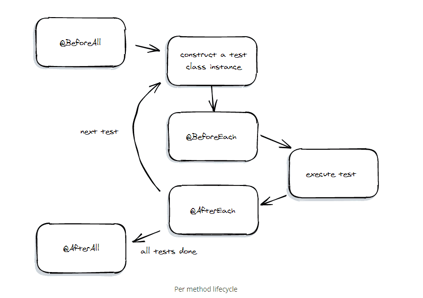

# 3. 스프링 핵심 원리 이해 2 - 객체 지향 원리 적용

## 3.1 새로운 할인 정책 개발

- 애자일 소프트웨어 개발 선언 - [링크](https://agilemanifesto.org/iso/ko/manifesto.html)

- 테스트 코드를 작성할 때, 성공하는 케이스도 중요하지만 실패하는 케이스 또한 중요하다.

## 3.2 새로운 할인 정책 적용과 문제점

- DIP(Dependency Inversion Principle)
    - 추상화에 의존해야지 구체화에 의존하면 안된다.
    - 구현 클래스가 아닌 인터페이스에 의존해야 한다.
- OCP(Open-Closed Principle)
    - 확장에는 열려 있고, 변경에는 닫혀 있어야 한다.
    - 기존 코드의 변경 없이 확장이 가능해야 한다.

### 문제점

- 역할과 구현을 충실히 분리했다 -> O
- 다형성을 활용해 인터페이스와 구현 객체를 분리했다 -> O
- OCP, DIP와 같은 객체 지향 설계 원칙을 준수했다 -> ?
    - DIP 위반<br>
    OrderServiceImple은 인터페이스인 DiscountPolicy와 구현체인 FixDiscountPolicy 둘 다에게 의존하고 있다.
    - OCP 위반<br>
    RateDiscountPolicy로 변경하려면 기존의 OrderServiceImple의 코드도 변경해야 한다.
    ```Java
    DiscountPolicy discountPolicy = new FixDiscountPolicy();
     ```

<br>

- 따라서 DIP, OCP를 지키기 위해서는 인터페이스에만 의존하도록 코드를 변경해야 한다.
```Java
DiscountPolicy discountPolicy; // = new FixDiscountPolicy();
```
- 단 이렇게만 하면 선언한 인터페이스 타입 변수에 할당된 구현체가 없어 NPE이 발생한다.

### 해결책
- 누군가가 OrderServiceImpl에 DiscountPolicy의 구현 객체를 대신 생성하고 주입해주면 된다!

## 3.3 관심사의 분리

- 애플리케이션 = 공연
- 인터페이스 = 배역
- 구현체 = 배우

#### **이전 코드 구조의 문제점**
- 남자 주인공 역할을 하는 배우 A가 여자 주인공 역할을 하는 배우를 직접 선택<br>
(DiscountPolicy에 대한 구현체를 OrderServiceImpl 내에서 선택 및 할당)
- 배우 A는 남자 주인공 역할을 연기해야 되는 책임과 상대 역할을 할 배우를 선택해야 하는 두가지 책임

#### **관심사를 분리하자!**
- 배우는 맡은 배역에 대한 연기에만 집중!
- 배우는 상대 역할을 어떤 배우가 하든지 해당 역할의 연기만 충실히 수행한다면 상관없음!
- 각 역할을 어떤 배우가 연기할지는 감독이 정하는 것
- 감독을 만들고, 배우와 감독의 책임을 확실히 분리
- 감독 -> AppConfig

### AppConfig
- 애플리케이션의 감독 역할
- 애플리케이션의 전체 동작 방식을 config(구성 또는 설정) 하기 위해 **구현 객체를 생성**하고 **연결**하는 책임을 가지는 별도의 설정 클래스

#### **구현**
- 애플리케이션의 실제 동작에 필요한 구현 객체를 생성
- 모든 구현 객체는 AppConfig를 통해서 생성
```Java
public class AppConfig {
    public MemberService memberService() {
        return new MemberServiceImpl(new MemoryMemberRepository());
    }

    // 생성자를 이용해 OrderServiceImpl, MemoryMemberRepository, FixDiscountPolicy 등의 구현 객체를 생성 및 주입
    public OrderService orderService() {
        return new OrderServiceImpl(new MemoryMemberRepository(), new FixDiscountPolicy());
    }
    ...
}
```
-> MemoryMemberRepository와 같이 여러 객체의 생성에 필요하여 중복되는 구현 객체의 경우, 클래스 영역으로 빼서 선언, 생성하고 각 생성자에 이미 생성한 객체를 넣어줄 수도 있다. (뒷 강의에 관련 내용 나올 예정)

#### **연결**
- 생성한 구현 객체를 필요로 하는 객체에 생성자를 통해서 주입(연결)
- 각 구현 객체는 생성자를 통해서 AppConfig로부터 필요한 구현 객체를 주입받음
```Java
public class OrderServiceImpl implements OrderService {
    private final MemberRepository memberRepository;
    private final DiscountPolicy discountPolicy;

    // 생성자를 매개로 외부(AppConfig)로부터 필요한 구현 객체를 주입받음
    public OrderServiceImple(MemberRepository memberRepository, DiscountPolicy discountPolicy) {
        this.memberRepository = memberRepository;
        this.discountPolicy = discountPolicy;
    }
    ...
}
```

- OrderServiceImpl은 더 이상 구현 객체를 의존하지 않음 - MemoryMemberRepository, FixDiscountPolicy
- 오직 인터페이스에만 의존 - MemberRepository, DiscountPolicy
- OrderServiceImpl 입장에서 생성자를 통해 어떤 구현 객체가 주입될지는 알 수 없음
- OrderServiceImpl의 생성자를 통해 어떤 구현 객체를 주입할지는 오직 외부(AppConfig)에서 결정
- OrderServiceImpl은 이제 의존관계에 대한 고민 X, 실행에만 집중!

#### **정리**
- 관심사의 분리 : 객체의 생성과 연결은 AppConfig가 담당, 각 구현 객체는 실행에만 집중
- DIP : MemberServiceImpl, OrderServiceImpl 등의 구현 객체는 추상에만 의존, 구체 클래스는 몰라도 된다.
- DI(Dependency Injection) : 의존관계 주입, AppConfig를 통해 생성되는 객체의 입장에서 보면 의존관계를 생성자를 통해 주입받는다.

### 테스트
```Java
public class OrderServiceTest {
    MemberService memberService;
    OrderService orderService;

    @BeforeEach
    public void beforeEach() {
        AppConfig appConfig = new AppConfig();
        memberService = appConfig.memberService();
        orderService = appConfig.orderService();
    }
    ...
```
- @BeforeEach
    - 각 테스트 메소드 실행 전에 실행
    - 각 테스트 시작 시 초기환경을 동일하게 하기 위해서 beforeEach() 메소드 내에 각 객체를 초기화하는 코드를 작성

<p align="center"></p>
