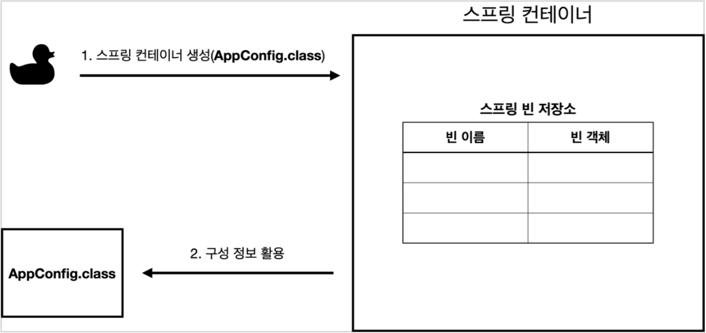
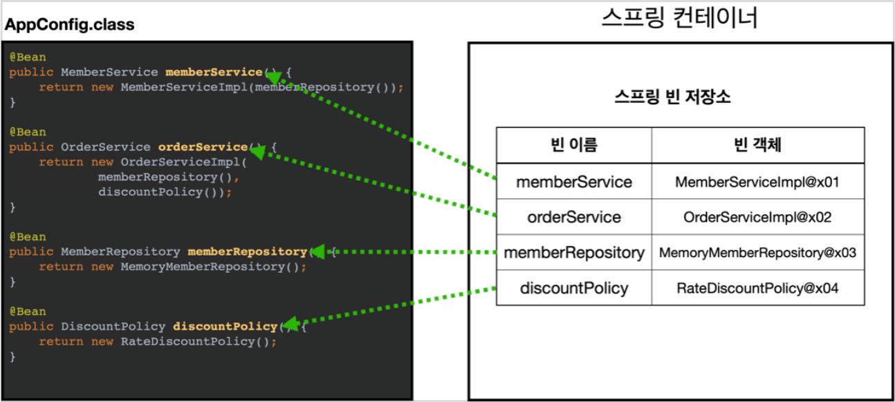
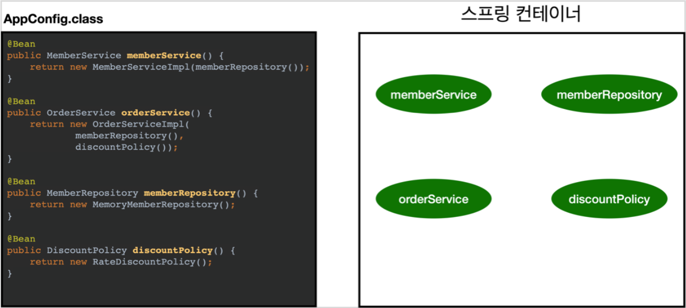
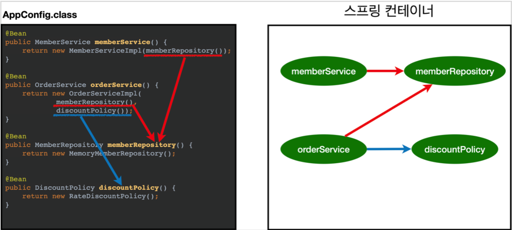
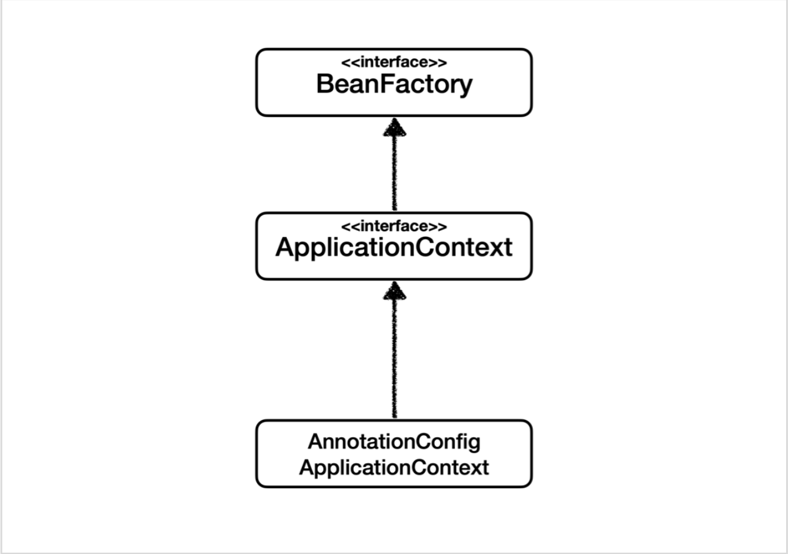
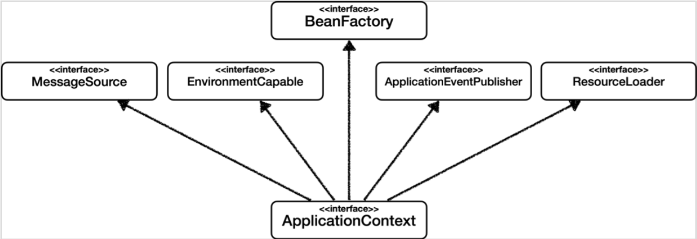
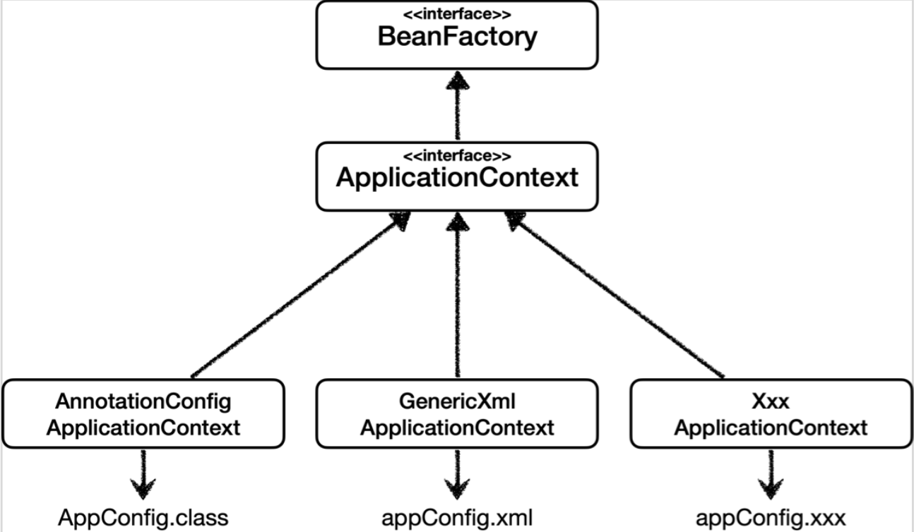
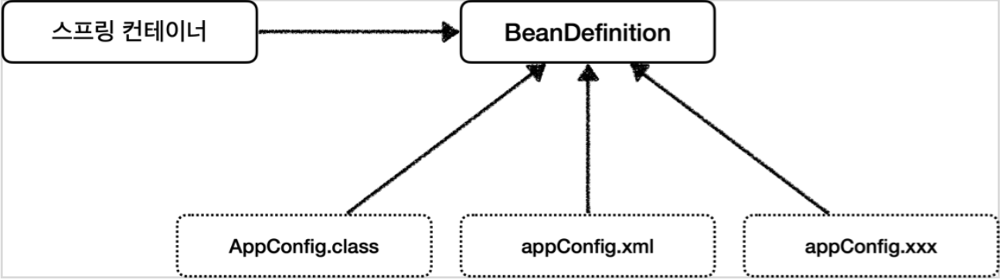
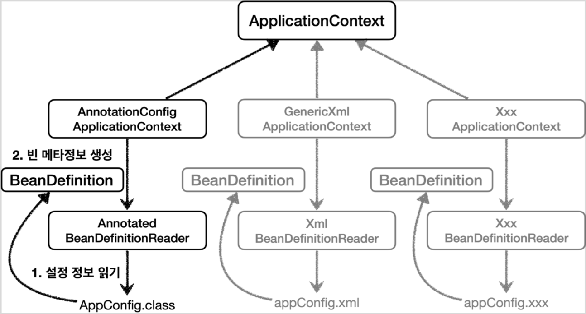

# 4. 스프링 컨테이너와 스프링 빈

## 4.1 스프링 컨테이너 생성

### `ApplicationContext`
- **스프링 컨테이너**
- 인터페이스 -> 여러 구현체가 존재한다.
    - XML 기반으로 생성하는 구현체
    - 애노테이션 기반의 자바 설정 클래스로 생성하는 구현체
    - 기타 여러 방식의 구현체가 존재
- 요즘은 애노테이션 기반의 자바 설정 클래스로 생성하는 방식이 많이 쓰임 -> 스프링 부트가 사용하는 방식
    ```Java
    ApplicationContext applicationContext = new AnnotationConfigApplicationContext(AppConfig.class);
    ```
    - `AnnotationConfigApplicationContext` <- `ApplicationContext` 인터페이스의 구현체
    - 직전에 AppConfig에 @Configuration, @Bean 등을 붙여 설정 클래스로 사용해 스프링 컨테이너를 만든 방식이 이 방식

> #### **# 참고**
> 정확히는 스프링 컨테이너를 부를 때 BeanFactory와 ApplicationContext로 구분한다.<br>
> BeanFactory를 직접 사용하는 경우는 거의 없어서 보통 ApplicationContext를 스프링 컨테이너라고 한다.<br>
> BeanFactory <- ApplicationContext <- 기타 유틸성 기능

### 스프링 컨테이너의 생성 과정

1. **스프링 컨테이너 생성**
    - 지정된 설정 정보를 활용해 스프링 컨테이너를 생성
    - `new AnnotationConfigApplicationContext(AppConfig.class)`
    <p align="center"></p>

2. **스프링 빈 등록**
    - 파라미터로 넘어온 설정 클래스 정보를 활용해 스프링 빈의 대상을 특정하고 등록
    - 애노테이션 기반 자바 설정 클래스를 이용하는 경우에는 @Bean 이 붙어 있는 메소드가 스프링 빈 등록 대상
    - 스프링 빈 저장소에 빈 이름을 key, 빈 객체를 value와 같은 형태로 저장
    <p align="center"></p>

    - 빈 이름
        - 빈 이름은 메소드 이름을 사용 - (Default)
        - 빈 이름을 직접 부여하는 것도 가능
            - `@Bean(name="memberService2")`
        - 빈 이름은 항상 서로 다른 이름을 부여해야 한다.
            - 같은 이름을 부여하게 되면 다른 빈이 무시되거나 덮어씌워질 수 있음

3. **스프링 빈 의존관계 설정 - 준비**
    <!-- - 스프링 빈 등록 -->
    <p align="center"></p>

4. **스프링 빈 의존관계 설정 - 완료**
    - 설정 정보를 참고하여 객체 간의 의존 관계 주입 (DI)
    <p align="center"></p>

    > #### **참고**
    > 사실 지금까지 진행한 것과 같이 자바 코드로 스프링 빈을 등록하게 되면 생성자를 호출하면서 의존 관계 주입까지 한번에 처리<br>
    > 그러나 온전히 스프링을 통해 스프링 빈을 등록하는 경우, 빈을 생성하고 의존관계를 주입하는 단계가 나누어져 있음<br>
    > 자세한 내용은 의존관계 자동 주입 참고

## 4.2 컨테이너에 등록된 모든 빈 조회

### 모든 빈 출력하기
```Java
@Test
@DisplayName("모든 빈 출력하기")
void findAllBean() {
    String[] beanDefinitionNames = ac.getBeanDefinitionNames();
    for(String beanDefinitionName : beanDefinitionNames) {
        Object bean = ac.getBean(beanDefinitionName);
        System.out.println("name= " + beanDefinitionName + " object= " + bean);
    }
}
```
- 스프링에 등록된 모든 빈 정보 출력
- `ac.getBeanDefinitionNames()` : 스프링에 등록된 모든 빈 이름 조회
- `ac.getBean()`: 빈 이름으로 빈 객체 조회

### 애플리케이션 빈 출력하기
```Java
@Test
@DisplayName("애플리케이션 빈 출력하기")
void findApplicationBean() {
    String[] beanDefinitionNames = ac.getBeanDefinitionNames();
    for(String beanDefinitionName : beanDefinitionNames) {
        BeanDefinition beanDefinition = ac.getBeanDefinition(beanDefinitionName);
        // Role ROLE_APPLICATION : 직접 등록한 애플리케이션 빈
        // Role ROLE_INFRASTRUCTURE : 스프링이 내부에서 사용하는 빈
        if(beanDefinition.getRole() == BeanDefinition.ROLE_APPLICATION) {
        System.out.println("name= " + beanDefinitionName + " object= " + bean);
        }
    }
}
```
- 스프링이 내부에서 사용하는 빈은 제외, 개발자가 등록한 빈만 출력
- `beanDefinition.getRole()` 로 구분 가능
    - `ROLE_APPLICATION` : 일반적으로 사용자가 정의한 빈
        - 설정 클래스인 AppConfig 도 사용자가 정의한 빈에 포함
    - `ROLE_INFRASTRUCTURE` : 스프링이 내부에서 사용하는 빈
- `getBeanDefinition()`
    - 빈에 대한 메타데이터 정보는 `ApplicatinoContext` 의 구현체인 `GenericApplicationContext` 에 구현
    - `AnnotationConfigApplicationContext` 는 `GenericApplicationContext` 를 상속받아 `getBeanDefinition()` 메소드를 가짐
    - `ApplicationContext` 에는 없음

> #### **# 참고**
> JUnit5부터는 테스트 클래스와 메소드에 public 붙이지 않아도 됨

## 4.3 스프링 빈 조회 - 기본

스프링 컨테이너에서 스프링 빈을 찾는 가장 기본적인 조회 방법

- `ac.getBean(빈이름, 타입)`
    ```Java
    MemberService memberService = ac.getBean("memberService", MemberService.class);
    ```
    ```Java
    MemberService memberService = ac.getBean("memberService", MemberServiceImpl.class);
    ```
    - 구체 타입으로 조회하는 것도 가능
        - AppConfig의 memberService 메소드의 반환 타입이 MemberService 이긴 하지만<br>
        스프링 빈 조회 시 스프링 빈에 등록된 객체 인스턴스 타입을 보고 가져오는 것이기 때문에 상관없음
    - 단, 구체 타입으로 조회 시 유연성이 떨어지기 때문에 좋은 방법은 아님
- `ac.getBean(타입)`
    ```Java
    MemberService memberService = ac.getBean(MemberService.class);
    ```
    - 동일한 타입의 빈이 2개 이상인 경우 오류 발생
    - 마찬가지로 구체 타입으로 조회 가능
- `ac.getBean(빈이름)`
    ```Java
    MemberService memberService = ac.getBean("memberService");
    ```
    - 빈 이름만 가지고 스프링 빈을 조회할 경우, 클래스를 지정하지 않아 Object 타입으로 반환<br>
    -> 사용 전 사용하고자 하는 타입으로 반드시 캐스팅

<br>

- 조회 대상 스프링 빈이 없으면 예외 발생
    - `NoSuchBeanDefinitionException: No bean named 'xxxxx' available`
    - 테스트 방법
        ```Java
        // import static org.assertj.core.api.Assertions.*;
        Assertions.assertThrows(NoSuchBeanDefinitionException.class, () -> ac.getBean("xxxx", MemberService.class));
        ```
        - assertThrows(예외클래스, 예외발생코드)
            - 예외 발생 코드를 실행했을 때, 예외 클래스의 예외가 발생하면 테스트 통과

## 4.4 스프링 빈 조회 - 동일한 타입이 둘 이상

- 타입으로 조회 시 동일한 타입의 스프링 빈이 둘 이상이면 오류 발생
    - `NoUniqueBeanDefinitionException`
    ```Java
    @Test
    @DisplayName("타입으로 조회 시 같은 타입이 둘 이상 있으면, 중복 오류가 발생한다")
    void findBeanByTypeDuplicate() {
        assertThrows(NoUniqueBeanDefinitionException.class, () ->
            ac.getBean(MemberRepository.class)
        );
    }
    ```
    > #### **# 참고**
    > 동일한 타입의 빈이 여러 개 있는 것은 이상하지 않음<br>
    > ex) 생성자 파라미터로 다른 값을 넘겨주어 동일한 객체이지만 다른 설정값(초기값)을 가지는 빈을 여러 개 만들어놓고 사용할 수 있다.

- 빈 이름 지정하여 해결
    ```Java
    @Test
    @DisplayName("타입으로 조회 시 같은 타입이 둘 이상 있으면, 빈 이름을 지정하면 된다")
    void findBeanByName() {
        MemberRepository memberRepository1 = ac.getBean("memberRepository1", MemberRepository.class);
        assertThat(memberRepository1).isInstanceOf(MemberRepository.class);
    }
    ```

- 특정 타입의 빈 모두 조회
    - `ac.getBeansOfType(타입)`
    ```Java
    @Test
    @DisplayName("특정 타입을 모두 조회하기")
    void findAllBeanByType() {
        Map<String, MemberRepository> beansOfType = ac.getBeansOfType(MemberRepository.class);
        for (String key : beansOfType.keySet()) {
            System.out.println("key = " + key + " value = " + beansOfType.get(key));
        }
        System.out.println("beansOfType = " + beansOfType);
        assertThat(beansOfType.size()).isEqualTo(2);
    }
    ```
<br>

> #### **# 참고**
> - 스프링 컨테이너는 여러 개의 설정 클래스를 가질 수 있음
> - 프로젝트 규모가 커지면 WebConfig 관련, SecurityConfig 관련 등 목적별로 설정 클래스를 분리하여 관리하기도 함

<br>

## 4.5 스프링 빈 조회 - 상속 관계

### 대원칙
부모 타입 호출 시 모든 자식 타입도 항상 함께 호출
- 부모 타입으로 조회 시 자식 타입도 같이 조회
- Object 타입으로 조회 시 모든 스프링 빈을 조회 (스프링 내부 빈 포함)

<br>

- 부모 타입으로 조회 시 자식이 둘 이상 있으면 중복 오류 발생
- 빈 이름 지정하여 해결
- 특정 자식 타입으로 조회하여 해결
    - 유연성이 떨어지기 때문에 좋은 방법은 아님

<br>

> #### **? 질문**
> - Test 클래스 안에 테스트에 사용하기 위한 TestConfig 클래스를 inner class로 하여 임시로 만드는데 이때 왜 static으로 선언하는지?
> ```Java
> public class Test {
>     AnnotationConfigApplicationContext ac = new AnnotationConfigApplicationContext(TestConfig.class);
>
>     @Configuration
>     static class TestConfig {
>         ...
>     }
> }
> ```
> 
> <br>
> 
> - static이 붙지 않은 inner class는 outer class에 종속<br>
> inner class를 사용하기 위해서는 outer class를 통해서만 사용 가능
> - 반면 static이 붙은 inner class는 outer class의 객체 생성 유무와 별개로 생성
> - TestConfig에 static 붙지 않은 경우
>   - Test 객체가 생성되어야 TestConfig 사용 가능
>   - Test 클래스 내에서 TestConfig가 생성되기도 전에 스프링 컨테이너에서 TestConfig 빈 요청
> - TestConfig에 static 붙은 경우
>   - Test 클래스와 별개로 TestConfig 객체 생성
>   - 스프링 컨테이너에서 TestConfig 빈 사용 가능
> - [링크](https://www.inflearn.com/course/%EC%8A%A4%ED%94%84%EB%A7%81-%ED%95%B5%EC%8B%AC-%EC%9B%90%EB%A6%AC-%EA%B8%B0%EB%B3%B8%ED%8E%B8/lecture/55356?tab=community&speed=1&q=257297)

<br>

## 4.6 BeanFactory와 ApplicationContext

<p align="center"></p>

### BeanFactory
- 스프링 컨테이너의 최상위 인터페이스
- 스프링 빈을 관리하고 조회하는 기능
- getBean() 제공

### ApplicationContext
- BeanFactory 상속
- BeanFactory의 빈 관리 기능 + 애플리케이션 개발 시 필요한 부가기능
- BeanFactory를 직접 사용할 일 거의 없음. 보통 ApplicationContext 사용
- BeanFactory나 ApplicationContext를 스프링 컨테이너라 부름

#### **ApplicationContext의 부가기능**

<p align="center"></p>

- MessageSource - 메시지 소스를 활용한 국제화 기능
    - 한국에서 접속하면 한국어로, 영어권에서 접속하면 영어로
- EnvironmentCapable - 환경변수
    - 로컬, 개발, 운영 환경 등을 관리
- ApplicationEventPublisher - 애플리케이션 이벤트
    - 이벤트 발행 및 구독 모델 지원
- ResourceLoader - 편리한 리소스 조회
    - 파일, 클래스패스, 외부 등에서 리소스 조회

<br>

## 4.7 다양한 설정 형식 지원 - 자바 코드, XML
- 스프링 컨테이너는 자바 코드, XML, Groovy 등 다양한 형식의 설정 정보를 사용할 수 있도록 유연하게 설계되어 있다.

<p align="center"></p>

- AnnotationConfigApplicationContext
    - 애노테이션 기반 자바 코드 설정을 사용하는 ApplicationContext의 구현체
    - 설정에 AppConfig.class 파일 사용
- GenericXmlApplicationContext
    - XML 기반 설정을 사용하는 ApplicationContext 구현체
    - 설정에 appConfig.xml 사용
- 기타 임의의 설정 파일을 사용하는 구현체를 직접 만드는 것도 가능

### 애노테이션 기반 자바 코드 설정
- 앞에서 지금까지 사용한 방식
- @Configuration, @Bean 등의 애노테이션을 이용하여 자바 코드로 된 설정 파일 (AppConfig.java) 작성
- `new AnnotationConfigApplicationContext(AppConfig.class)`

### XML 설정
- 스프링 부트를 많이 사용하는 요즘에는 자주 쓰이지 않는 방식<br>
(스프링 부트는 애노테이션 기반 설정 방식 이용)
- 컴파일 없이 빈 설정 정보를 변경할 수 있다는 장점
- `new GenericXmlApplicationContext("appConfig.xml")`
#### **XML 설정 사용 코드**
```Java
@Test
void xmlAppContext() {
    ApplicationContext ac = new GenericXmlApplicationContext("appConfig.xml");
    MemberService meberService = ac.getBean("memberService", MemberService.class);
}
```
- 스프링 컨텍스트를 생성하는 구현체만 다를 뿐 생성된 스프링 컨텍스트를 사용하는 방법은 애노테이션 방식과 동일

#### **XML 설정 코드**
```xml
...
<bean id="memberService" class="hello.core.member.MemberServiceImpl">
    <constructor-arg name="memberRepository" ref="memberRepository"/>
</bean>
<bean id="memberRepository" class="hello.core.member.MemoryMemberRepository"/>
...
```
- main의 resources 폴더에 위치
    - 경로 : `src/main/resources/appConfig.xml`
- 자바 코드로 작성된 AppConfig.java와 거의 비슷
    - bean : 스프링 빈 대상 = @bean
    - id : 스프링 빈 이름 = 메소드명
    - class : 스프링 빈 객체 타입 = 반환 타입<br>
    -> `src/main/java` 이후의 경로, 패키지명을 다 써줘야 함
    - constructor-arg : 스프링 빈 생성 시 파라미터로 전달될 것들 = 생성자 파라미터

<br>

## 4.8 스프링 빈 설정 메타 정보 - BeanDefinition

### BeanDefinition
- 빈 설정 메타정보
- `@Bean` , `<bean>` 당 하나씩 메타정보 생성
- 스프링 컨테이너는 메타정보를 기반으로 빈 생성

#### **내부 동작 로직**
<p align="center"></p>

- 스프링은 `BeanDefinition` 이라는 인터페이스(추상화)를 통해 다양한 설정 형식을 지원
    - 스프링 컨테이너는 자바 코드인지 XML인지 알 필요 없이 BeanDefinition만 알면 ok
    - 역할 : BeanDefinition<br>
    - 구현 : 자바 코드(AppConfig.class), XML(appConfig.xml)
        - 자바 코드를 읽어서 BeanDefinition 생성
        - XML을 읽어서 BeanDefinition 생성

<p align="center"></p>

- 각 `ApplicationContext` 구현체는 설정 파일을 읽고 BeanDefinition을 생성하는 `BeanDefinitionReader` 를 가짐
    - `AnnotationConfigApplicationContext` 는 `AnnotatedBeanDefinitionReader` 를 사용해서 `AppConfig.class` 를 읽고 `BeanDefinition` 을 생성
    - XML을 이용하는 경우도 동일
    - 새로운 형식의 설정 정보를 추가하고자 하는 경우, 그에 맞는 BeanDefinitionReader를 만들어서 BeanDefinition을 생성하면 됨

#### **BeanDefinition 정보**
- BeanClassName : 생성할 빈의 클래스명 (자바 설정처럼 팩토리 역할의 빈 사용 시에는 없음)
- factoryBeanName : (팩토리 역할의 빈을 사용할 경우) 이름 ex) appConfig
- factoryMethodName : (팩토리 역할의 빈을 사용할 경우) 메소드 지정 ex) memberService
- Scope : 싱글톤 (기본값)
- lazyInit : 빈 생성 시점 지연 처리 여부, 스프링 컨테이너를 생성할 때 빈을 생성하지 않고 실제 빈을 사용할 때 빈을 생성하는 것
- InitMethodName : 빈 생성 및 의존관계 적용 완료 뒤, 호출되는 메소드명
- DestroyMethodName : 빈 생명주기가 끝나고 제거되기 직전, 호출되는 메소드명
- Constructor arguments, Properties : 의존관계 주입 시 사용 (자바 설정처럼 팩토리 역할의 빈 사용 시에는 없음)

<br>

- 스프링에 빈을 등록하는 방법은 크게 2가지가 있음
    - 직접 스프링 빈을 등록하는 방법 -> XML
    - 팩토리 메소드(팩토리 빈)를 통해 등록하는 방법 -> 자바 코드

```Java
@Test
@DisplayName("빈 설정 메타정보 확인")
void findApplicationBean() {
    String[] beanDefinitionNames = ac.getBeanDefinitionNames();
    for (String beanDefinitionName : beanDefinitionNames) {
        BeanDefinition beanDefinition = ac.getBeanDefinition(beanDefinitionName);
        if(beanDefinition.getRole() == BeanDefinition.ROLE_APPLICATION) {
            System.out.println("beanDefinition = " + beanDefinitionName + " beanDefinition = " + beanDefinition);
        }
    }
}
```
- ApplicationContext에는 BeanDefinition 관련 기능 없음<br>
구현체에 존재
- BeanDefinition을 직접 생성해서 스프링 컨테이너에 바로 등록하는 것도 가능 -> 실무에서 BeanDefinition을 직접 만질 일은 거의 없다