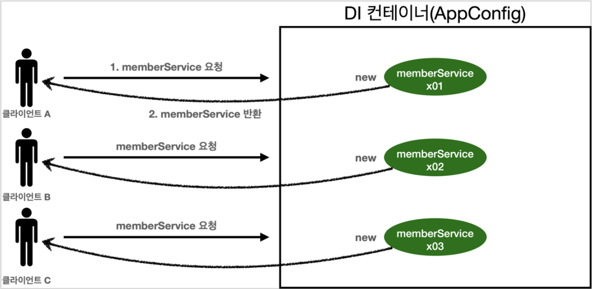
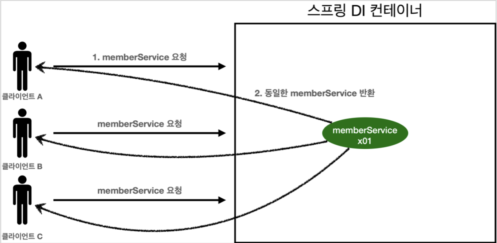

# 5. 싱글톤 컨테이너

## 5.1 웹 애플리케이션과 싱글톤

- 대부분의 스프링 애플리케이션은 웹 애플리케이션
    - 기업용 온라인 서비스 기술을 지원하기 위해 탄생
    - 웹 외에 데몬, 배치 등의 애플리케이션도 물론 스프링으로 개발 가능
- 웹 애플리케이션은 보통 여러 사용자가 동시에 요청하는 환경

<p align="center"></p>

- 스프링을 사용하지 않는 순수한 자바 DI 컨테이너(AppConfig)는 요청이 들어올 때마다 객체를 새로 생성하여 반환
- 고객 트래픽이 초당 100 -> 초당 100개의 객체가 생성되고 GC에 의해 소멸 -> **메모리 낭비**
- 객체를 딱 1개만 생성하고 동일한 객체 요청에 대해 기존에 생성한 객체를 공유하는 것으로 해결 -> **싱글톤 패턴**

<br>

> #### **# 참고**
> JUnit - `isEqualTo()` vs `isSameAs()`
> - `isEqualTo()` : 대상의 값을 비교, Object.equals() 비교
> - `isSameAs()` : 대상의 주소값를 비교, a == b 비교
> - [링크](https://dev-emmababy.tistory.com/55)

<br>

## 5.2 싱글톤 패턴

- 전체 JVM 내에서 클래스의 인스턴스가 딱 1개만 생성되는 것을 보장하는 디자인 패턴
- 객체 인스턴스를 2개 이상 생성하지 못하도록 막음

```Java
public class SingletonService {
    // 1
    private static final SingletonService instance = new SingletonService();
    // 2
    public static SingletonService getInstance() {
        return instance;
    }
    // 3
    private SingletonService() {}

    public void logic() {
        System.out.println("싱글톤 객체 로직 호출");
    }
}
```
1. static 영역에 자기 자신의 객체 인스턴스를 미리 1개 생성해서 올려둠<br>
private로 선언하여 외부에서 직접 접근 불가<br>
final로 선언하여 변경 불가
2. 객체 인스턴스가 필요한 경우, `getInstance()` 를 통해서만 접근 가능<br>
호출 시 항상 동일한 객체 인스턴스 반환
3. 생성자를 private로 선언하여 외부에서 `new 생성자` 를 통한 객체 생성 불가하도록 설정<br>
추가적인 객체 생성을 막아 JVM 전체에서 단 한개만 존재하도록 보장

<br>

> #### **# 참고**
> 싱글톤 패턴을 구현하는데에 다양한 방법 존재
> - Eager Initialization
>   - 객체를 미리 생성하고 추가 객체 생성을 방지하는 방법
>   - 위에서 사용한 방법
> - Lazy Initialization
>   - 객체를 미리 생성하지 않고, 객체가 필요한 시점에 생성
>   - 생성된 객체가 있는지 확인하여 없으면 객체 생성하여 반환, 있으면 기존에 생성된 객체 반환
> - 기타
> - [링크](https://sabarada.tistory.com/128)

> #### **# 참고**
> Singleton vs Static class
> - [링크](https://blog.naver.com/ss1511/221586516299)

<br>

- 스프링 컨테이너는 기본적으로 모든 객체를 싱글톤으로 생성하여 관리
- 싱클톤 패턴을 사용함으로서 사용자의 요청이 들어올 때마다 객체를 생성하는 것이 아닌 하나의 객체만 생성, 공유하여 효율적으로 사용

<br>

### 싱글톤 패턴의 문제점
- 싱글톤 패턴을 구현하기 위한 추가적인 코드 필요
- 호출하는 쪽이 구체 클래스에 의존 -> DIP 위반 -> OCP 원칙을 위반할 가능성 상승
    - `SingletonService.getInstance()` -> 싱글톤을 구현한 구체 클래스의 getInstance()를 직접 호출해야 하기 때문에 구체 클래스에 의존될 수 밖에 없음
- 유연하게 테스트하기 어려움
- 내부 속성을 변경하거나 초기화하기 어려움
- private 생성자를 사용하여 자식 클래스를 만들기 어려움
- 결론적으로 유연성이 떨어짐
- 안티 패턴으로 불리기도 함

-> **스프링 컨테이너는 위의 싱글톤 단점들을 모두 해결**

> #### **# 참고**
> Singleton이 DIP 위반?
> - Singleton 객체를 바로 사용하는게 아닌 중간에 AppConfig를 통해 메소드 호출 시 싱글톤 객체를 반환받는 형태로 하면 괜찮지 않나?
> - [링크1](https://www.inflearn.com/course/%EC%8A%A4%ED%94%84%EB%A7%81-%ED%95%B5%EC%8B%AC-%EC%9B%90%EB%A6%AC-%EA%B8%B0%EB%B3%B8%ED%8E%B8/lecture/55362?tab=community&speed=1.25&q=123791)
> - [링크2](https://www.inflearn.com/course/%EC%8A%A4%ED%94%84%EB%A7%81-%ED%95%B5%EC%8B%AC-%EC%9B%90%EB%A6%AC-%EA%B8%B0%EB%B3%B8%ED%8E%B8/lecture/55363?tab=community&speed=1.25&q=104609)

<br>

## 5.3 싱글톤 컨테이너

스프링 컨테이너는 싱글톤 패턴의 문제점을 해결하면서 모든 객체 인스턴스를 싱글톤으로 관리한다.

### 싱글톤 컨테이너
- 스프링 컨테이너는 싱글톤 패턴을 따로 적용하지 않아도 객체 인스턴스를 싱글톤으로 관리
- 스프링 컨테이너 - 싱글톤 컨테이너 역할
    - 싱글톤 레지스트리 : 싱글톤 객체를 생성하고 관리하는 기능
- 따라서 스프링 컨테이너 사용 시 싱글턴 패턴의 단점을 해결하면서 객체를 싱글톤으로 관리 가능
    - 싱글톤 패턴 구현을 위한 추가적인 코드 필요 X
    - DIP, OCP, 테스트, private 생성자에 대한 단점 X

#### **싱글톤 컨테이너 적용 후**
<p align="center"></p>

- 사용자의 요청이 들어올 때마다 객체 생성하는 것이 아닌 이미 만들어진 객체를 공유하여 효율적으로 재사용

> #### **# 참고**
> - 스프링의 기본 빈 등록 방식은 싱글톤
>   - 거의 대부분 싱글톤 방식 이용
> - 싱글톤 방식 외에 다른 방식도 지원
>   - 요청할 때마다 새로운 객체를 생성하여 반환
>   - HTTP Request 생명주기에 빈 생명주기를 맞추기
>   - 사용자가 들어올 때 객체 생성해서 나갈 때 죽이기
>   - HTTP Session의 생명주기와 맞추기
>   - 기타 등등
> - 빈 스코프에서 자세한 내용 설명

<br>

## 5.4 싱글톤 방식의 주의점

### Stateless 한 설계
- 싱글톤 방식은 여러 클라이언트가 하나의 동일한 싱글톤 객체 인스턴스를 공유하기 때문에 **싱글톤 객체는 상태를 유지(stateful)하게 설계하면 안된다!!!**
- 무상태(stateless)로 설계
    - 특정 클라이언트에 의존적인 멤버 변수 X
    - 특정 클라이언트가 값을 변경할 수 있는 멤버 변수 X
    - 가급적 읽기만 가능
    - 필드 대신에 공유되지 않는 지역변수, 파라미터, ThreadLocal 등을 사용
- 스프링 빈의 멤버 변수에 공유 값을 설정 -> **큰 장애 발생 위험!!!**

<br>

#### **Stateful한 설계의 예시**

```Java
public class StatefulService {
    // 상태를 유지하는 멤버 변수(필드) -> 싱글톤 객체를 사용하는 모든 곳에서 공통!
    private int price;

    // 상태값을 모든 곳에서 공유되는 멤버 변수(필드)에 저장
    public void order(String name, int price) {
        System.out.println("name = " + name + ", price = " + price);
        this.price = price; // 문제 발생!!
    }

    public int getPrice() {
        return price;
    }
}

...

    @Test
    void statefulServiceSingleton {
        ApplicationContext ac = new AnnotationConfigApplicationContext(TestConfig.class);

        StatefulService s1 = ac.getBean("statefulService", StatefulService.class);
        StatefulService s2 = ac.getBean("statefulService", StatefulService.class);

        // ThreadA : userA 10000 주문
        s1.order("userA", 10000);
        // ThreadB : userB 20000 주문
        s2.order("userB", 20000);

        // 기댓값 : 10000 -> 결과값 : 20000
        int price = s1.getPrice();
    }
```

#### **Stateless한 설계의 예시**

```Java
public class StatelessService {
    // 상태값을 모든 곳에서 공유되는 멤버 변수(필드)에 저장하지 않고 메소드의 지역변수(파라미터)로만 사용
    public int order(String name, int price) {
        System.out.println("name = " + name + ", price = " + price);
        return price;
    }
}

...

    @Test
    void statelessServiceSingleton {
        ApplicationContext ac = new AnnotationConfigApplicationContext(TestConfig.class);

        StatefulService s1 = ac.getBean("statefulService", StatefulService.class);
        StatefulService s2 = ac.getBean("statefulService", StatefulService.class);

        // ThreadA : userA 10000 주문
        int priceA = s1.order("userA", 10000);
        // ThreadB : userB 20000 주문
        int priceB = s2.order("userB", 20000);

        // 기댓값 : 10000 -> 결과값 : 10000
        priceA;
    }
```

